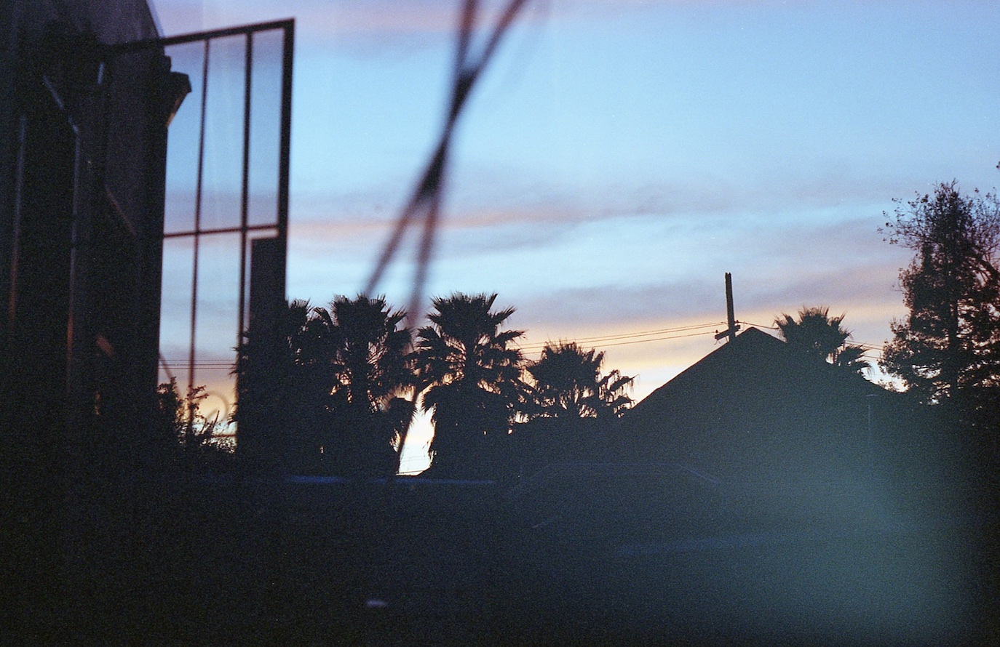
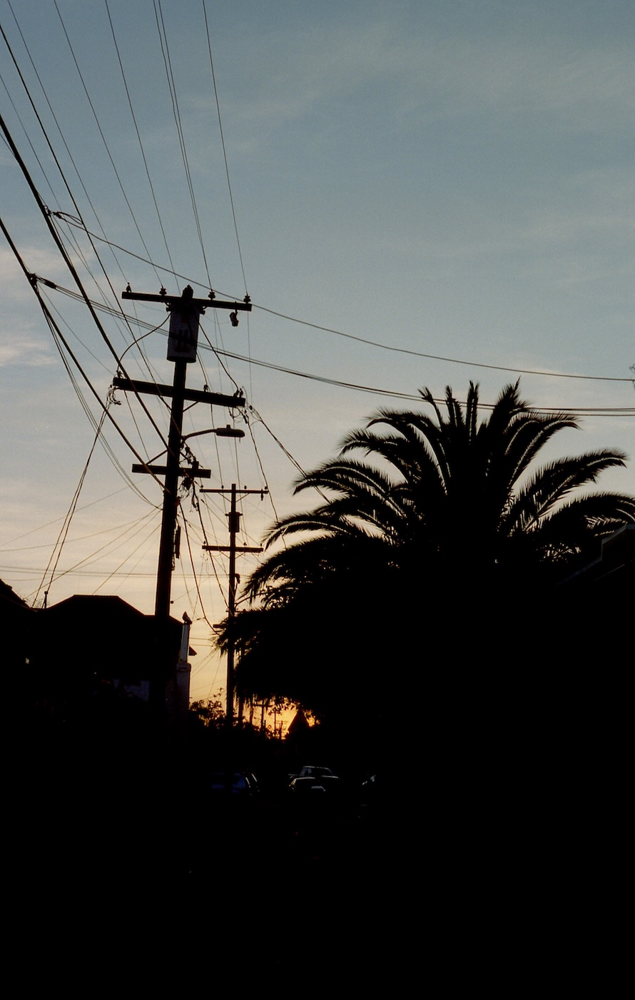
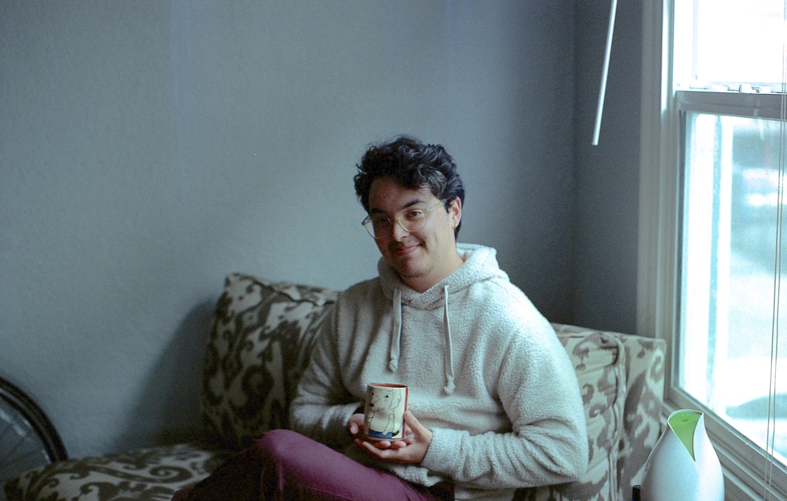
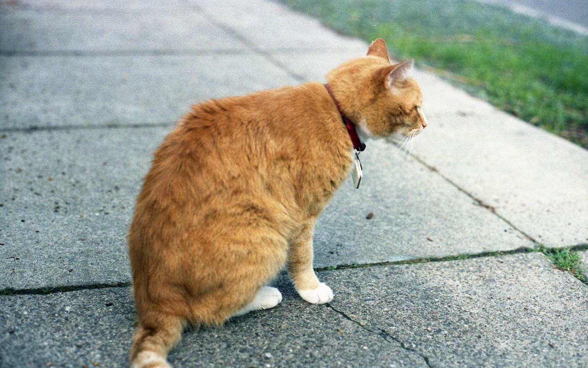
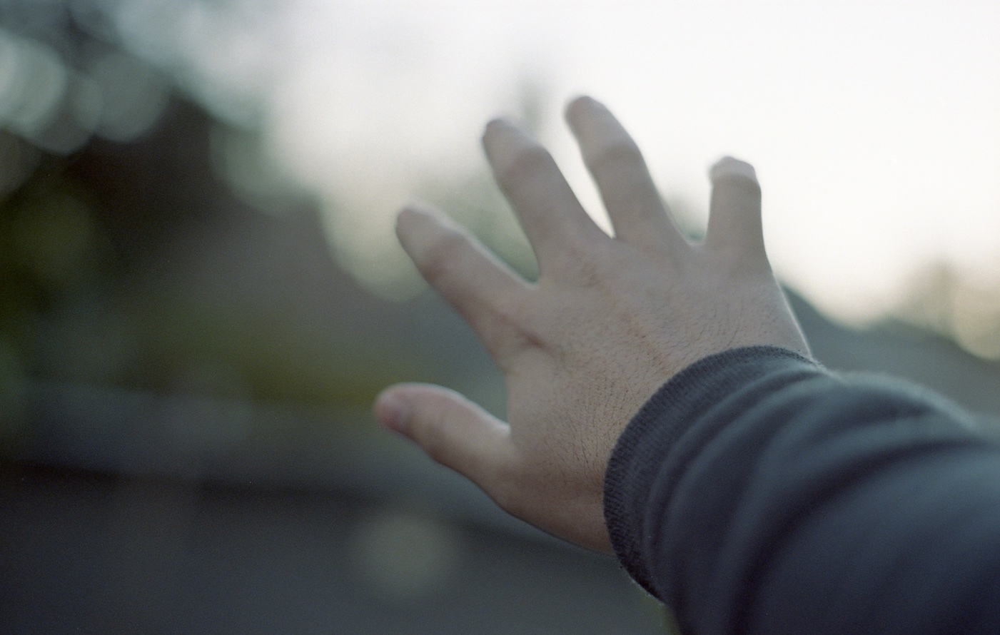
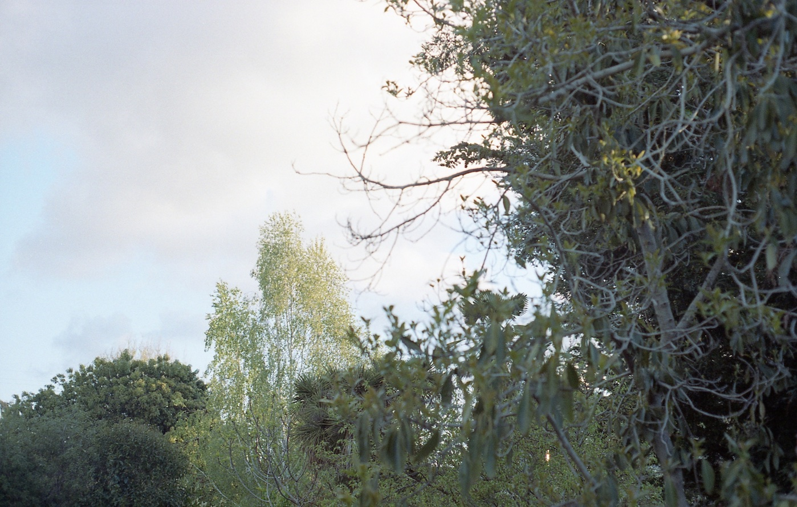

These aren't actually my first EVER rolls of film, because I A) took photography in high school (and my class was the last ever to get to use the darkroom before it was torn out and replaced by a computer lab for digital, RIP), and B) I shot a few rolls on an old point and shoot in college, but those were totally automatic, I didn't develop or scan them myself, and that was so long ago. So these are my first rolls when I really got into film photography.

This happened to be _right_ before the pandemic started, and I'm honestly so glad, because film photography was such an amazing hobby to have during the first year and a half of COVID - it got me outside and walking, mindfully, almost every single day.

## Black & White

I messed up the film loading on this first roll (the white shapes are where the film was touching itself so didn't get exposed to the chemicals) because I was not familiar with the style of reel I got from the local shop - after this I switched to the Patterson tank, which I was already familiar with from my high school class, and I find that much easier to load onto. Like most of my other accidents with film, though, I find the surprises and the way the process is made visible enticing and exciting.

<section class="portrait-img-group">
  
  
</section>
<section class="portrait-img-group">
  
  
</section>

## Color

<section class="portrait-img-group">
  
  
</section>

