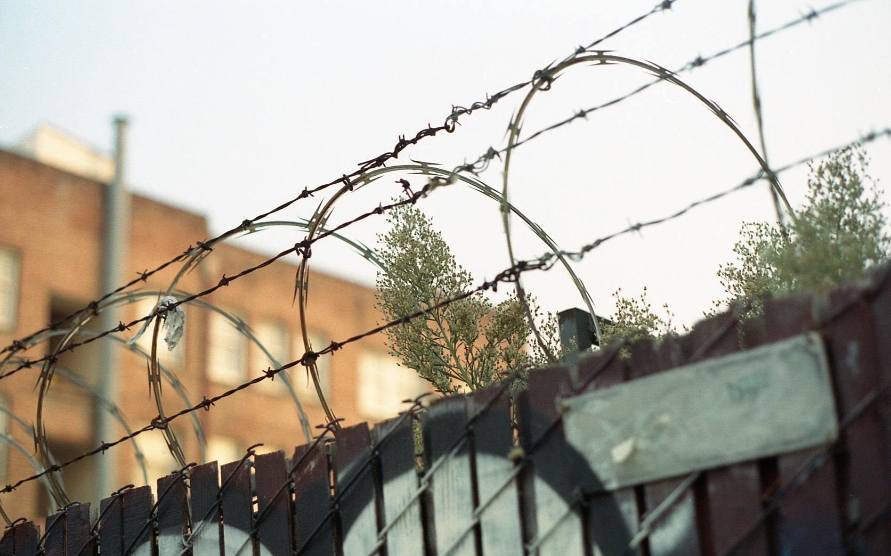

I was leaving my job that I'd been at for the last two and a half years, and had a little break in between (just a long weekend, really). My friends in Oakland were going to be out of town and generously offered to let me stay in their apartment. I worked the last few days of my job from there, and then spent the long weekend visiting old spots and meeting up with old friends (and my sister, who, in a way, is also an old friend), and taking a lot of photos on my Pentax Spotmatic SLR. I had just gotten started back into film photography, and I was stoked to have the opportunity to be in a place where there was endless interesting material for photos.

## Oakland

<section class="portrait-img-group">
  
  
</section>

<section class="portrait-img-group">

</section>

## Friends

<section class="portrait-img-group">
  
  
</section>

<section class="portrait-img-group">
  
  
</section>
<section class="portrait-img-group">
  
  
</section>

## ~A Vibe~

<section class="portrait-img-group">
  
  
</section>

<section class="portrait-img-group">
  
  
</section>

## Richmond, SF

