I couldn't really get into just how fuzzy the toy lens is, but I enjoyed trying it all the same. The overlapping frames aspect definitely shook things up in a fun and creative way. A few of these (I'm honestly not even sure which) were taken by Jenn, because I gave them the camera to take on a walk with them one afternoon.

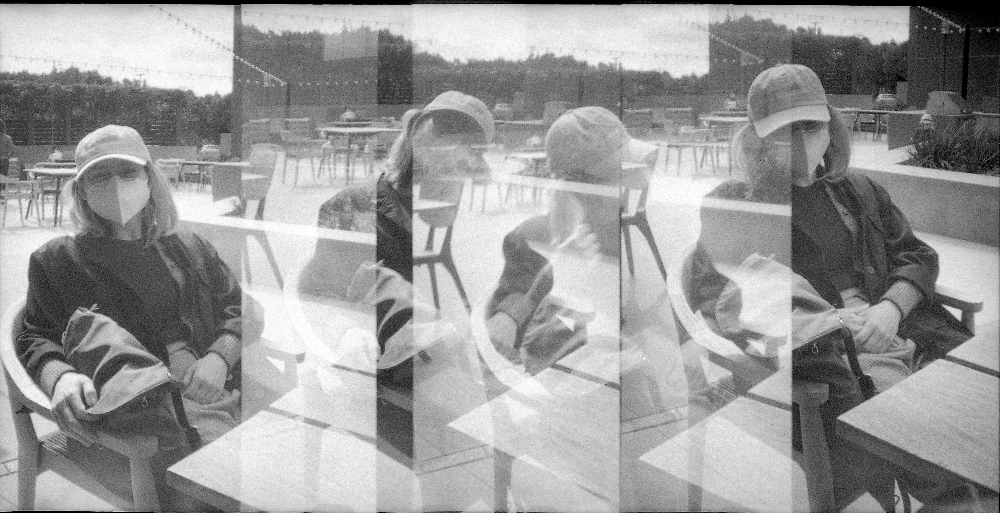
<section class="portrait-img-group">
  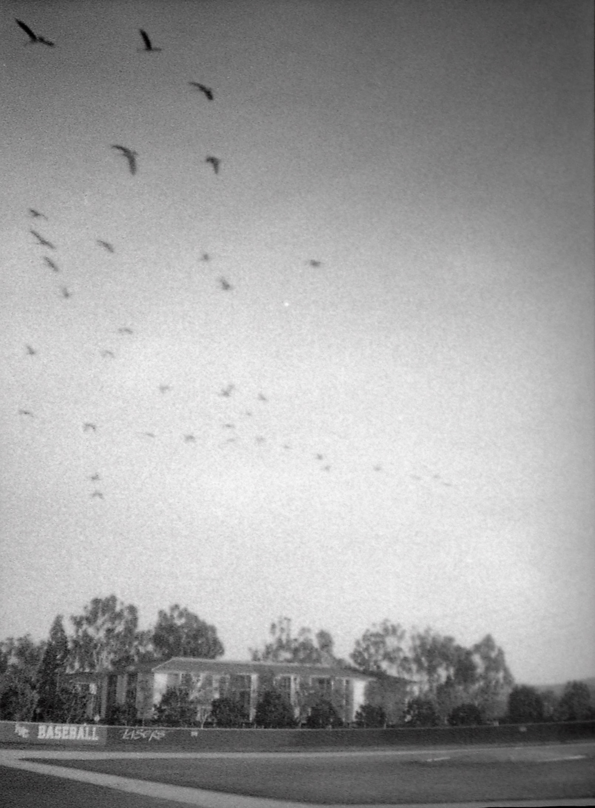
  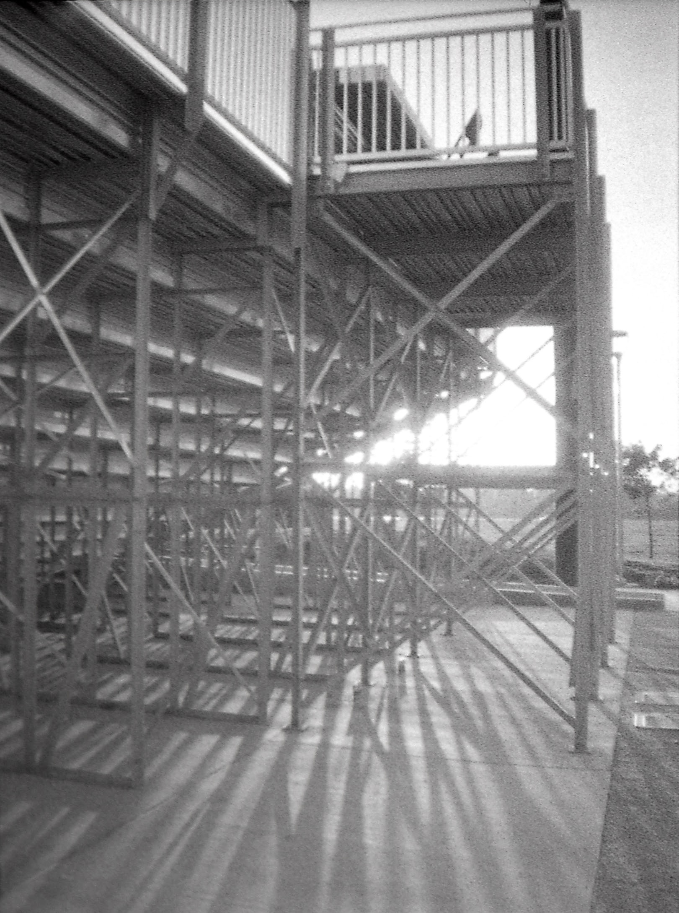
</section>
<section class="portrait-img-group">
  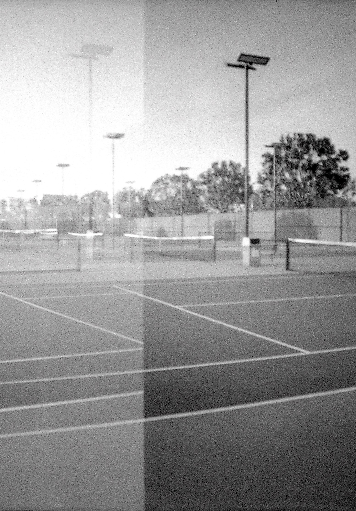
  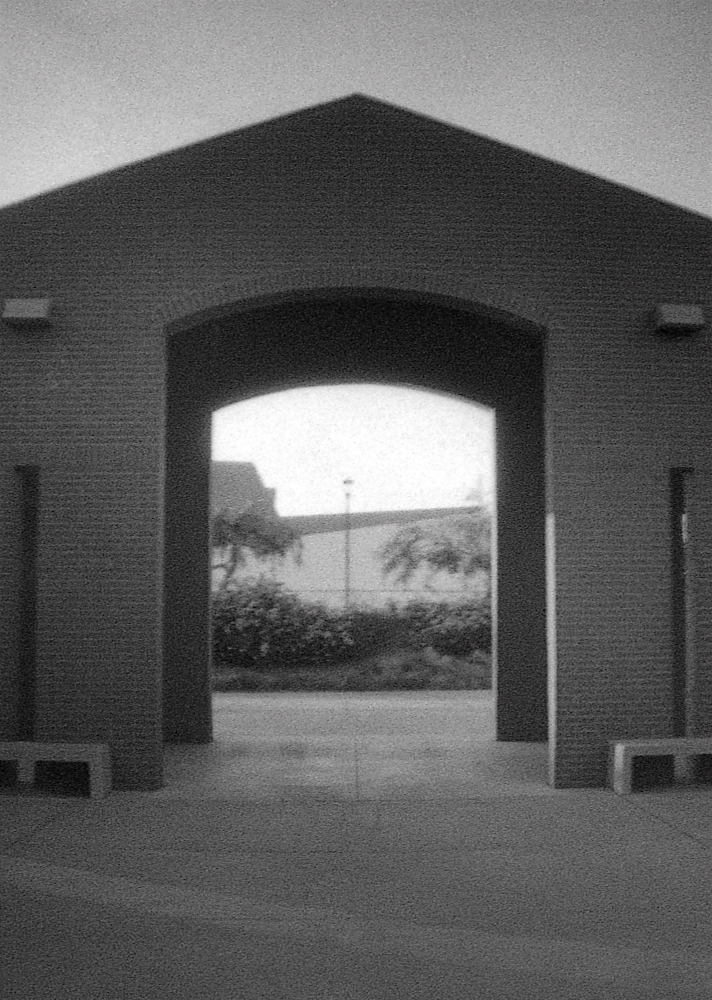
</section>
<section class="portrait-img-group">
  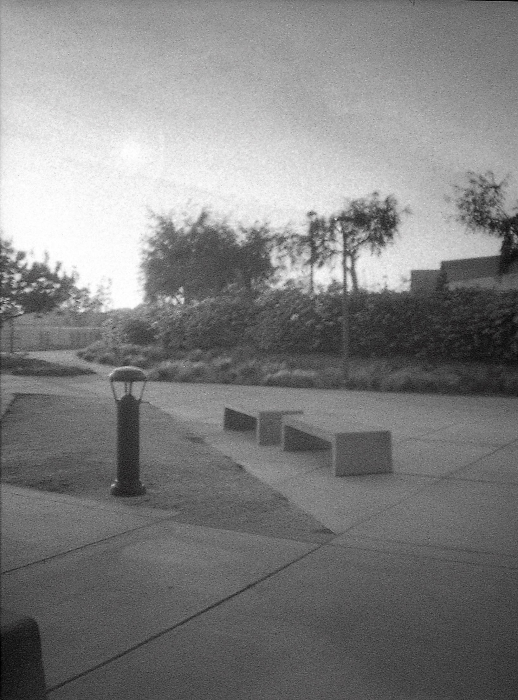
  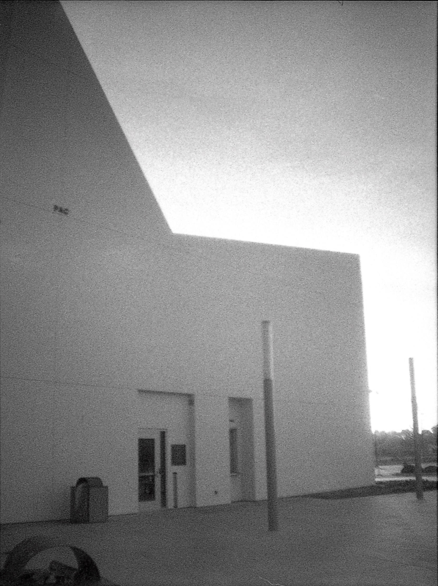
</section>
<section class="portrait-img-group">
  
  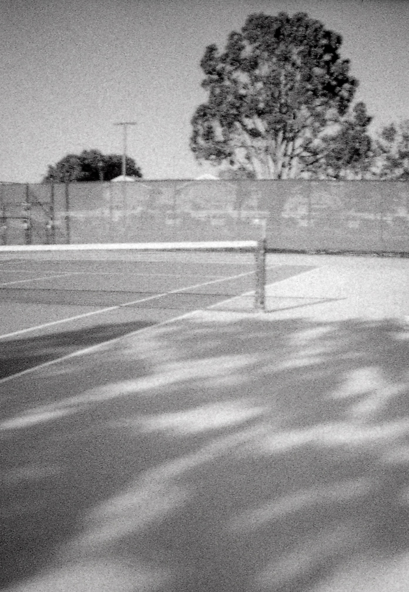
</section>
<section class="portrait-img-group">
  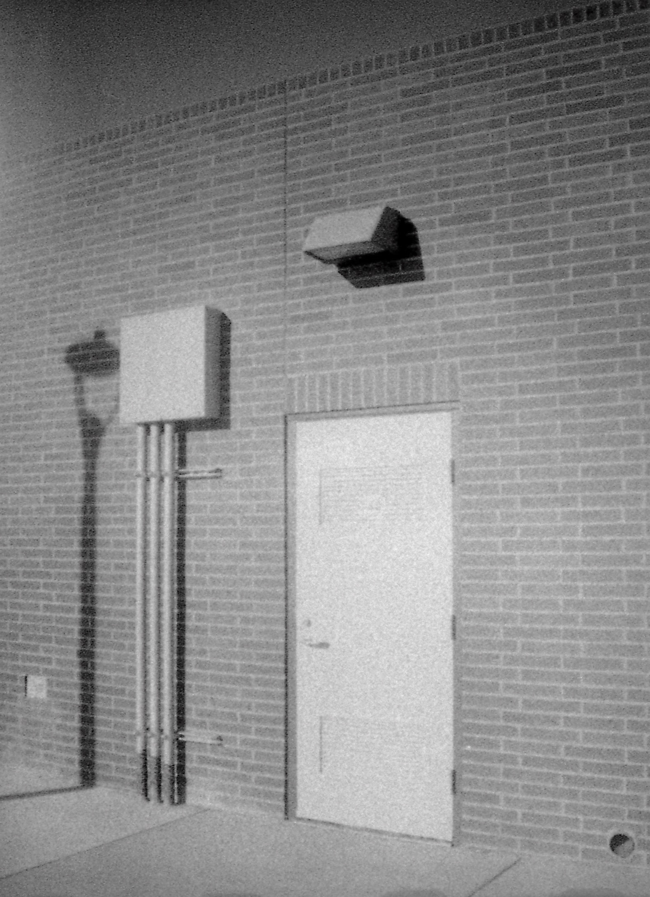
  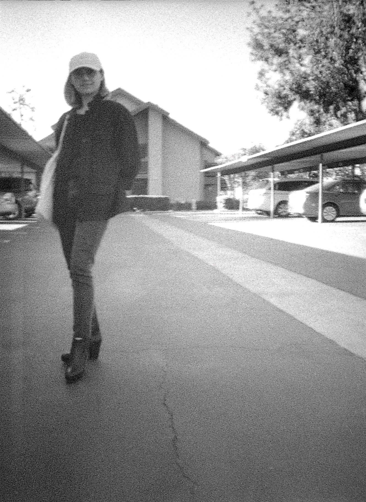
</section>
<section class="portrait-img-group">
  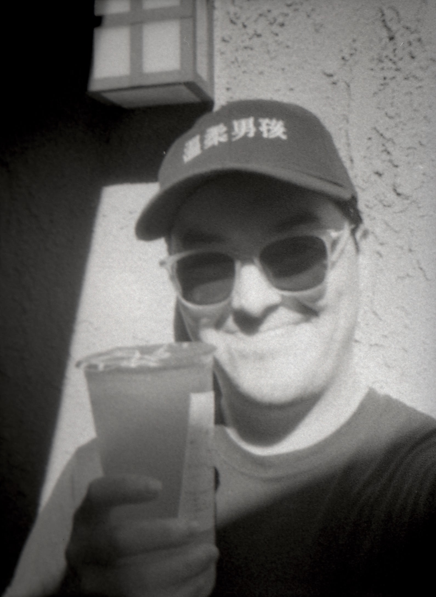
  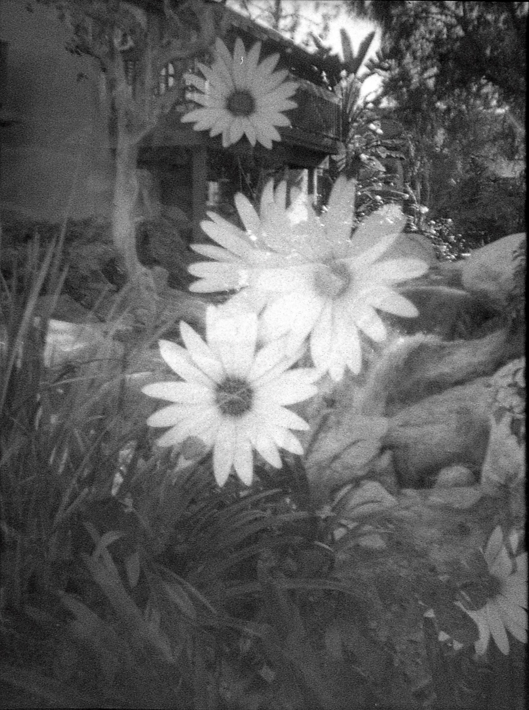
</section>
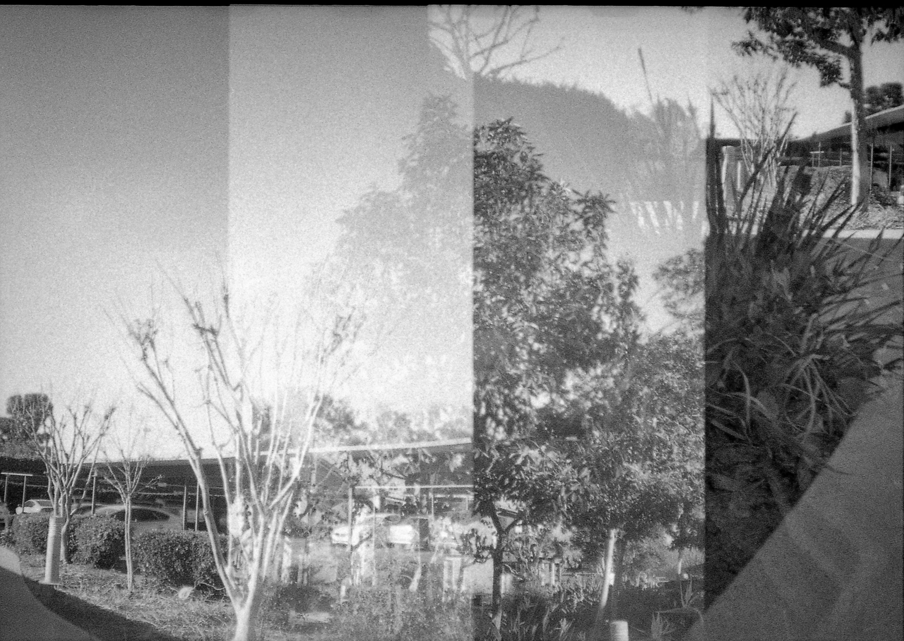
